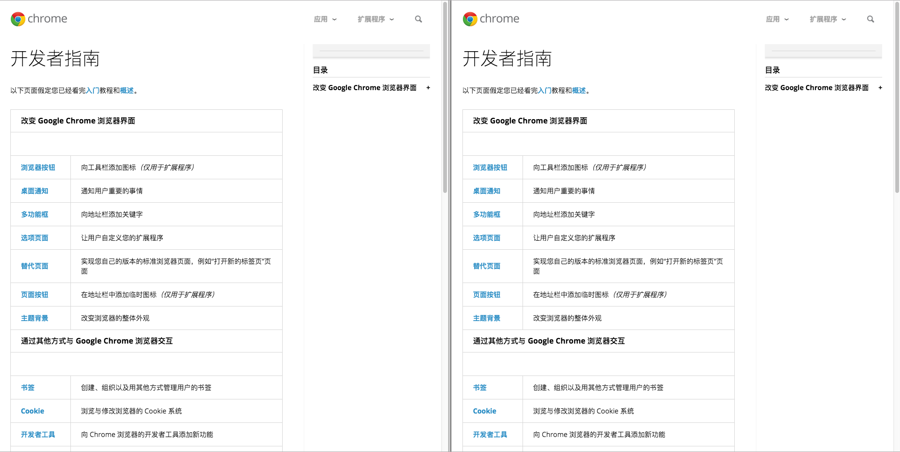

# Chrome Extension for Screen Split

Chrome 分屏插件，基于 Frameset 加载两个相同 url 的 Frame 实现。（核心代码只有一句，忘了是从知乎还是 StackOverflow 复制而来...在原有书签的基础上换了一种展现形式）。

## Usage

- `git clone` 源代码。
- 打开 Chrome，在“扩展程序”设置中选择“加载已解压的扩展程序”即可。
- 打开任意网页，点击插件图标即可启用。

## Screenshot

## Todo

- [ ] 解决 CSP 导致加载失败问题。

## ChangeLog

- 2018-09-28：解决因为 `X-Frame-Options` 导致分屏失败。

